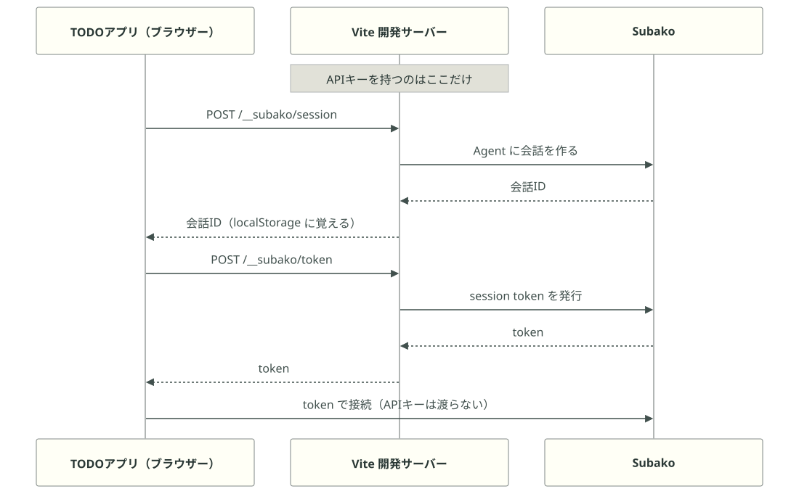
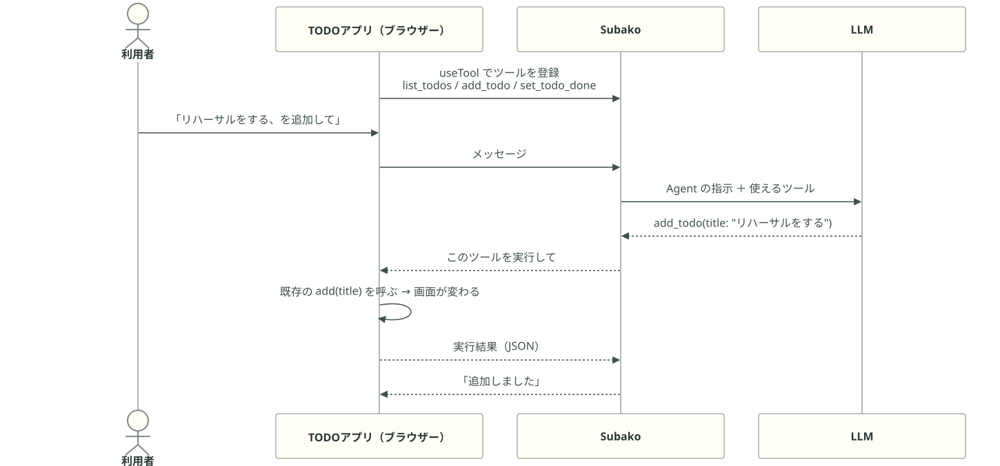
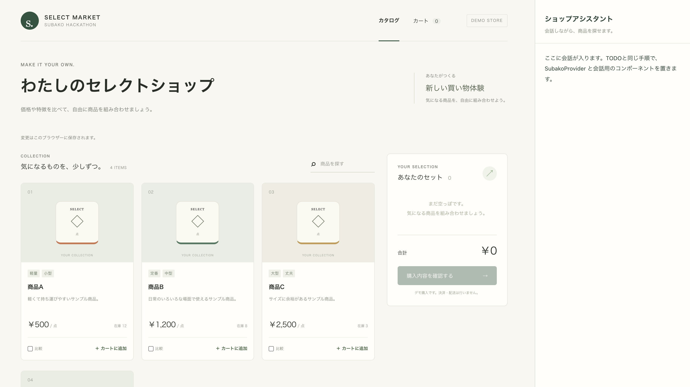
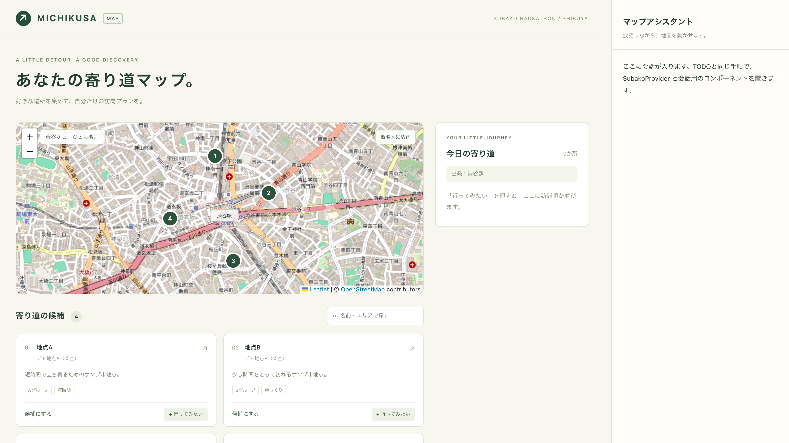
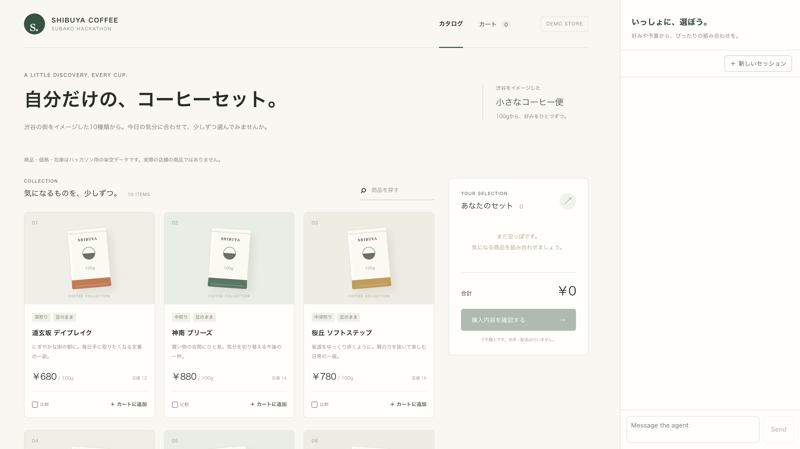
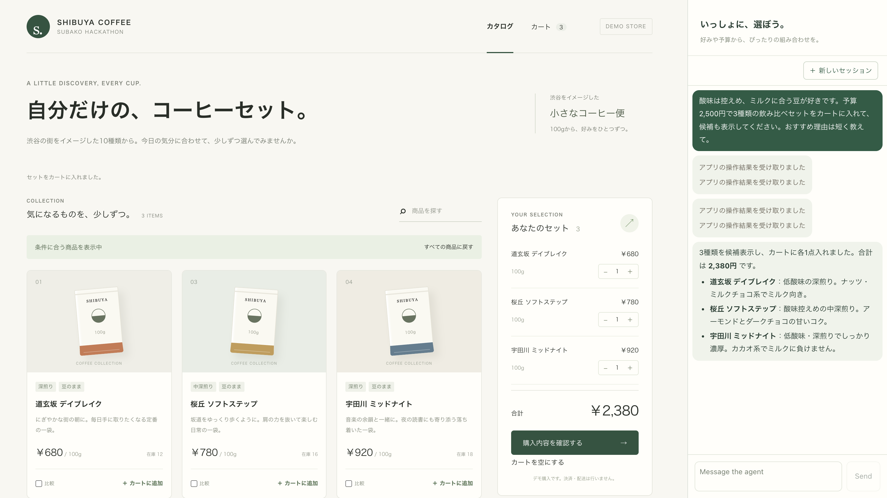
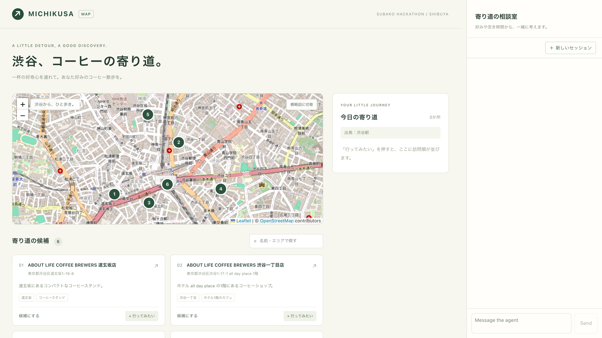
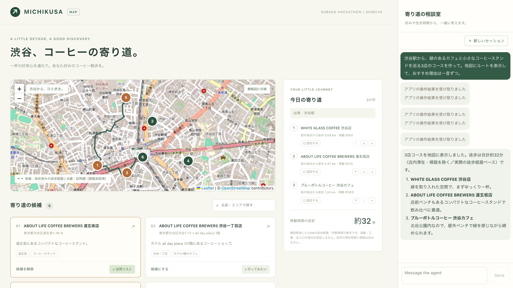
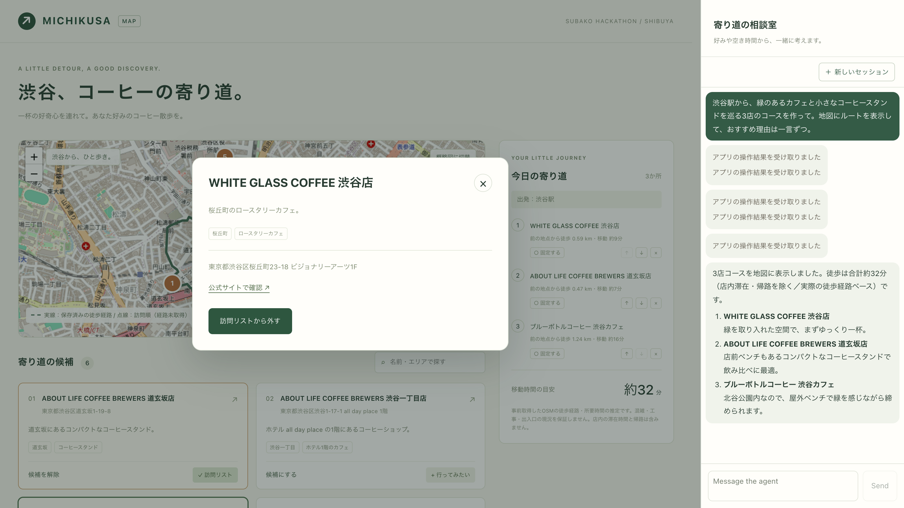

<!-- _class: cards -->

# 開始までのお願い

15:15 頃に開始します。それまでに 3 つお願いします。

- **Wi-Fi** Plug and Play の Wi-Fi に接続<br>SSID: `pnpj_guest_5G`<br>パスワード: `20200406`
- **GitHub アカウント** Codespaces を使うと環境構築なしで始められます
- **Discord** 質問・相談は [Subako Discord Server](https://discord.gg/PkDFYjyyHX) で受け付けます。<br><br><center></center>

---

<!-- _class: cover -->

# Subako Hackathon 9/14

Build Agents, Not Infrastructure

###### 2026-09-14 · Kikuvi Inc.

---

# Subakoについて

[Concept Movie](https://www.youtube.com/watch?v=Vpt5voDm1j8)

---

<!-- _class: hex -->

###### Platform

# Subakoとは

AIエージェントの開発に必要なインフラを提供するプラットフォームです。

-  **ハーネス** *harness* LLM を呼び、ツールを実行する
-  **セッション** *sessions* 会話の状態を保持するストレージ
-  **サンドボックス** *sandbox* LLM が生成したコードを実行する
-  **Vault** *vault* 認証情報の管理
-  **Agent Skills** *skills* スキルの管理

インフラと SDK を提供することで、既存のアプリケーションにエージェント機能を組み込み、新たな体験を提供できます。

---

# ハッカソンについて

自分のアイデアで、アプリを使いやすくするエージェントを作ります。

- **皆で TODO** 普通の React アプリに SDK とツールを組み込む流れを体験します
- **チームで EC / Map** コメントを解除して動かし、データと選び方を自分たちの題材に変えます
- **発展は自由** Skills・MCP・独自ツール・UI も、作品に必要なものから足せます
- **発表は 60 秒の動画** 誰を助けるかと、実際に画面が変わるところを見せてください

---

<!-- _class: team -->

# 運営メンバー

本日の運営は 8 名です。詰まったら近くのメンバーか Discord にどうぞ。

-  **Kento Sato** 佐藤 拳斗 *Founder / CEO*
-  **Shun Kashiwa** 柏 舜 *Founding Engineer*
-  **Masa Ishihara** 石原 正宗 *Founding AI/ML Engineer*
-  **Takumi Okoshi** 大越 拓実 *AI/ML Engineer*
-  **Takayuki Nagai** 長井 崇行 *Founding Designer*
-  **Hironori Kawamoto** 川本 博詔 *Software Engineer*
-  **Kosei Matsuyama** 松山 皓星 *Software Engineer*
-  **Ryuji (RJ) Miyasaka** 宮坂 龍司 *Customer Success*

---

# 代表挨拶

---

# 本日の流れ

| 時間 | 内容 |
| :---- | :---- |
| 15:00 | 受付・コーヒー |
| 15:15 | Subako の説明とハンズオン |
| 15:45 | 実装時間 |
| 18:00 | 実装終了・作品提出タイム |
| 18:15 | 交流時間 |
| 19:00 | 結果発表 |
| 19:20 | イベント終了・片付け |
| 19:30 | 完全撤収 |

---

<!-- _class: section -->

###### HANDS-ON

# ハンズオン

普通の React TODO アプリに、皆で一緒にエージェントを組み込みます。

---

<!-- _class: cards -->

###### HANDS-ON

# ハンズオンの流れ

- **1. 環境** リポジトリを Fork し、Codespaces かローカルで開く
- **2. アカウント** CLI で Subako に登録し、Org・workspace・API キーを用意する
- **3. 起動** `.env.local` を設定して TODO アプリを立ち上げる
- **4. 組み込み** SDK を入れて agent を publish し、`useTool` でツールを登録する

---

<!-- _class: cards -->

###### STEP 1

# リポジトリを Fork する

[`subako-ai/subako-hackathon-2026-09-14`](https://github.com/subako-ai/subako-hackathon-2026-09-14) を自分のアカウントに Fork します。

- **Codespaces** 環境構築に自信がない人はこちら。Fork 先で Code → Codespaces → Create codespace。CLI のインストール・`npm ci`・`.env.local` の準備まで自動で走る
- **ローカル** macOS / Linux に Node.js 22.12 以上を用意して `git clone`。CLI は次のステップで入れる

---

###### STEP 2

# Subako CLI のインストール

Codespaces ではインストール済みです。`subako --version` が通れば次へ。

```sh
curl --proto '=https' --tlsv1.2 -LsSf \
  https://github.com/subako-ai/subako-cli/releases/latest/download/subako-cli-installer.sh | sh
subako --version
```

- コマンドが見つからないときは、新しいターミナルを開く
- Windows でローカル開発したい人は Codespaces を推奨

---

###### STEP 3

# アカウントと Organization の作成

`<ORG HANDLE>` は自分だけの Org 名に置き換えます。

```sh
subako cloud signup --org <ORG HANDLE> --name "Subako Hackathon"
subako login --org <ORG HANDLE>
subako whoami
subako workspace create --name hackathon
subako workspace use hackathon
```

- 表示された URL をブラウザで開いて登録を完了する

---

###### STEP 4

# Subako Credit の取得

本日の参加者には $20 相当の Subako Credit を付与します。下記シートに氏名と Org Handle を記入してください。

```sh
subako org credits      # クレジット残高を表示
subako org show         # 現在の Org 情報を表示
```


https://docs.google.com/spreadsheets/d/1trHI1-7zHLJ59BzS0ylmAX3wX1Xk36MWApkT-Kp-Zds/edit?usp=sharing

---

###### STEP 5

# API キーの発行

アプリから Subako に接続するためのキーです。期限は明日の 0 時にしています。

```sh
subako api-key mint \
  --label "hackathon-2026-09-14" \
  --permission agent.read --permission agent.publish \
  --permission model_provider.read \
  --permission session.create --permission session.read --permission session.manage \
  --expires-at 2026-09-15T00:00:00+09:00
```

- `sbk_ak` で始まるキーが一度だけ表示されます。コピーしてください

---

<!-- _class: code-text -->

###### STEP 6

# TODO アプリの起動

```sh
npm ci         # Codespaces は実行済み
npm run setup   # .env.local を作成

# 以下は .env.local をエディターで開いて記入
SUBAKO_API_KEY=発行したキー

npm run dev -- todo
```

- ローカルは `http://127.0.0.1:5173`、Codespaces は Ports の 5173
- **`VITE_` が付かないキーはブラウザーへ渡りません。** 使うのは開発サーバーだけ
- キーが空でも TODO の手動操作はできる。サイドバーは空のまま
- 以降のコマンドは **2 つ目のターミナル** で打つ。`Ctrl+C` で止めなくてよい
- `apps/todo/src/App.tsx` の `add` と `complete` がどこから呼ばれているか探しておく

---

# モデルの使用について

`SUBAKO_MODEL_PROVIDER_ID=01a07f90-238c-7de3-b55e-6fe53de063cf` で Subako 提供のモデルを使えます。推論時に Subako のクレジットを消費します。

```
01a07f90-238c-7de3-b55e-6fe53de063cf  type=platform  format=openai_responses  label=Subako
  model=crow     label=Crow     Balanced capability and cost for everyday tasks.
  model=hawk     label=Hawk     For complex reasoning and coding tasks.
  model=sparrow  label=Sparrow  For simple, high-volume agent tasks.
```

- 一覧は `subako model list`
- OpenAI Responses API 対応のモデルと API キーを登録して使うこともできます。この場合クレジットは消費しません（`subako model-provider create`）

---

<!-- _class: center -->

###### CHECKPOINT

# ここまでのチェック

- TODO の追加・完了ができた
- CLI にログインでき、モデル一覧と残高を確認できた
- API キーを `.env.local` に保存した

---

<!-- _class: cards -->

###### CONCEPT

# Agent, Session, Tool

アプリに組み込むときに使う 3 つの概念です。

- **Agent** モデル・指示・Skills・MCP をまとめた設定。設定を変更して publish すると、新しい version を作ります。
- **Session** Agent に紐付く会話。履歴は Subako に残ります。「新しいセッション」で、最新の設定を使う会話に切り替えます。
- **Tool** Agent が呼べる関数。Client tools は、ブラウザーなどで動く関数をエージェントに提供します。

---

###### STEP 7

# SDK のインストールと publish

```sh
# SDK を todo アプリの依存に追加
npm install --workspace @hackathon/todo \
  @subako-ai/sdk@0.1.2 @subako-ai/react@0.1.2 @subako-ai/assistant-ui@0.1.2 \
  @assistant-ui/react@0.15.19 @assistant-ui/react-markdown@0.14.15 zod@4.6.4

# agent の作成・publish
npm run agent:publish -- todo
```

- `agents/todo/prompt.md` がAgentのシステムプロンプトになります。
- `subako agent list` を実行すると作成されたAgentを確認できます。
- `.env.local` が変わったので、開発サーバーを `Ctrl+C` で止めて `npm run dev -- todo` を再起動してください。

---

<!-- _class: compact -->

###### STEP 8

# App.tsx の作業箇所

`apps/todo/src/App.tsx` で `TODO(` を検索すると、手順 1〜6 が見つかります。

| 目印 | 場所 | やること |
|---|---|---|
| `TODO(1)` | 先頭 | SDK と `session.ts` の import を有効にする |
| `TODO(2)` | `storageKey` の下 | `SubakoSessionClient` と会話の保存キーを有効にする |
| `TODO(3)` | `App` の直前 | `TodoAssistant` と `list_todos` / `add_todo` を有効にする |
| `TODO(4)` | 手順 3 の関数内 | `set_todo_done` を書く（次のスライド） |
| `TODO(5)` | `App` の中 | `useSessionId` で使う会話を用意する |
| `TODO(6)` | サイドバーの中 | 案内の `<p>` を消し、その下の JSX コメントを解除する |

- **手順 4 以外はコメントを解除するだけです。** 手順 6 は `{/*` と `*/}` の行を消します
- `useTool` の `execute` から、画面でも使う関数を呼びます。`schema` は Zod で定義します
- 「新しいセッション」と、会話の作成に失敗したときの再試行も含まれます

---

<!-- _class: code-text -->

###### STEP 9

# TODO(4)：完了ツール

```tsx
useTool(client, 'set_todo_done', {
  description:
    '一覧で取得したidのTODOを完了・未完了にする。',
  schema: z.object({
    id: z.string(),
    done: z.boolean(),
  }).strict(),
  execute: ({ id, done }) =>
    JSON.stringify(complete(id, done)),
});
```

- 手順 3 の `useTool` と同じ形で、既存の `complete(id, done)` を呼ぶ
- 「発表を練習する、を追加して」「発表を練習する、は完了した」で動作を確かめる
- 手で別の TODO を完了にしてから「残りを教えて」と聞く
- 「新しいセッション」で会話が切り替わる。TODO のデータは残る

---

<!-- _class: figure -->

###### HANDS-ON

# 1. つなぐまで

APIキーはブラウザーへ渡しません。会話の作成と token の発行を開発サーバーに任せます。



---

<!-- _class: figure -->

###### HANDS-ON

# 2. 会話のたびに

`useTool` で登録した既存の関数が、LLM から呼ばれて画面を変えます。



---

<!-- _class: section -->

###### HACK TIME

# ハックタイム

18:00まで。自分の題材でエージェントを作ります。

---

<!-- _class: cards -->

###### HACK TIME

# サンプルで工夫する、自分のアプリで挑戦する

- **EC / Map を使う** 最初の 15 分で、用意した連携コードのコメントを解除してデモを動かします。そのあと、題材のデータと prompt を工夫します。Skills・MCP の追加も自由です。
- **自分のアプリを使う** TODO で体験した手順を自分のアプリへ。SDK を入れ、会話をつなぎ、既存の操作関数を `useTool` で登録します。EC / Map への独自ツール・UI の追加も歓迎です。

---

<!-- _class: shots -->

###### SAMPLE APPS

# 2 つのスターター

どちらも汎用データで手動操作できます。会話とツールのコードは、`App.tsx` に**コメントアウトした状態で用意済み**です。

-  **EC** `apps/ec` サンプル商品 4 点。比較・カート・購入確認まで手で動きます
-  **マップ** `apps/map` 渋谷周辺のサンプル地点 4 つ。候補と訪問順を地図に出せます

---

<!-- _class: shot -->

###### 作例 · EC ①

# コーヒーの EC にしてみる

`apps/ec-coffee` は、スターターのデータを 10 種のコーヒー豆に差し替えたものです。



---

<!-- _class: shot -->

###### 作例 · EC ②

# 好みと予算を伝える

「酸味は控えめ、ミルクに合う豆。予算 2,500 円で 3 種の飲み比べセットを」。一覧が 3 点に絞られ、カートに入り、**理由が一言ずつ**返ります。



---

<!-- _class: shot -->

###### 作例 · MAP ①

# 渋谷のコーヒー屋を巡る

`apps/map-coffee` は、地点を渋谷の 6 店舗に差し替えたものです。実在の店舗情報と、事前に取得した徒歩経路を持っています。地図は OpenStreetMap。



---

<!-- _class: shot -->

###### 作例 · MAP ②

# 条件を言うとコースになる

「緑のあるカフェとコーヒースタンドを巡る 3 店のコースを作って」。候補・訪問順・徒歩経路が地図に描かれ、**合計約 32 分**と返ります。



---

<!-- _class: shot -->

###### 作例 · MAP ③

# 提案の上から、人が調整する

気になった店を開いて詳細を見る。固定する、順番を入れ替える、外す。AI が出すのは、**人が書き換えられる下書き**です。



---

<!-- _class: cards -->

###### 作例

# コーヒーの作例で変えたところ

スターターにも同じ操作ツールがあります。まずは、データと指示で自分の題材を表現できます。

- **データ** コーヒー豆 10 種、渋谷の 6 店舗。`metadata` に酸味・焙煎度・店の特徴など、画面には出さない判断材料を入れています
- **prompt** 好みや予算をどう聞くか、何を比べて選ぶか、理由をどう伝えるか。題材に合わせて指示を変えています
- **画面・経路** 題材に合う文言や表示を調整。Map の完成例には事前取得した徒歩経路もあります。スターターの点線は訪問順、時間は概算です

---

<!-- _class: compact -->

###### HACK TIME · 最初の 15 分

# EC / Map の起動とコメント解除

`<app>` を `ec` または `map` に置き換え、リポジトリのルートで実行します。

```sh
npm install --workspace @hackathon/<app> \
  @subako-ai/sdk@0.1.2 @subako-ai/react@0.1.2 @subako-ai/assistant-ui@0.1.2 \
  @assistant-ui/react@0.15.19 @assistant-ui/react-markdown@0.14.15 zod@4.6.4
npm run agent:publish -- <app>
npm run dev -- <app>
```

- `apps/<app>/src/App.tsx` で `TODO(` を検索し、**手順 1〜6 のコードをコメント解除**。EC / Map は書き足し不要です
- 手順 3 の関数は、中の手順 4 もまとめて解除します
- 手順 6 は案内の `<p>` を消し、その下の `{/*` と `*/}` の行を消します
- EC は **5177**、Map は **5175**。Codespaces は Ports から開きます

---

<!-- _class: cards -->

###### HACK TIME · 最初の 15 分

# 最初に動かすデモ

まずは汎用データのまま、会話から画面が変わることを確認します。

- **EC** 「商品AとBを比較して、予算2,000円で各1点をカートに入れて」<br><br>比較パネルに A・B が並び、カートの合計が **1,700 円**になります。購入確定は画面のボタンで行うデモです。
- **Map** 「地点AとCを候補にして、A→Cの順で回りたい。Aは固定して」<br><br>候補と訪問順が地図に出て、**A が固定**されます。手で順番を変えたあとも、AI に相談できます。

「新しいセッション」で会話を切り替えても、カートや訪問順は残ります。

---

###### HACK TIME · アイデア

# チームで決める 4 行

**発表で入力する依頼文を 1 つ決め、同じ依頼で改善を確かめます。**

| 決めること | コーヒーの EC なら |
|---|---|
| 誰が、どんな場面で使うか | 好みが違う家族で、飲み比べ用の豆を買いたい |
| エージェントが優先する条件 | 合計予算を守り、味が偏らない組み合わせにする |
| metadata に入れる判断材料 | 酸味、焙煎度、フレーバーノート、ミルクとの相性 |
| デモの依頼文と期待する画面 | 「酸味控えめで、予算内の 3 種セットを」。候補とカートが変わる |

コードを増やさなくても、**誰のために、どう選ぶか**で作品の違いが出ます。

---

<!-- _class: compact -->

###### HACK TIME · 進め方

# 動くデモを残しながら工夫する

時間は目安です。開始が遅くなった場合も、18:00 に実装を終えます。

| 順 | やること | 目安 |
|---|---|---|
| 1 | コメントを解除し、汎用データで最初のデモを動かす | 15 分 |
| 2 | チームで 4 行を決める | 10 分 |
| 3 | 題材のデータを作り、アプリに入れる | 25 分 |
| 4 | prompt で選び方を工夫。必要なら Skills に手順をまとめる | 30 分 |
| 5 | デモを改善。必要なら MCP・独自ツール・UI を追加する | 35 分 |
| 6 | 発表の依頼文で通して動かし、見せ方を整える | 20 分 |

**18:00 に実装終了。18:00〜18:15 に録画し、フォームへ提出します。**

---

<!-- _class: compact -->

###### HACK TIME · データ

# データを変えるファイル

運営が案内する **Web のデータ生成チャット**で JSON を作り、エディターでファイルに貼り付けます。

| | EC | Map |
|---|---|---|
| 編集するファイル | `apps/ec/data/catalog.json` | `apps/map/src/data.json` |
| コーヒーの見本 | `apps/ec-coffee/data/catalog.json` | `apps/map-coffee/src/data.json` |
| 前のデータが残る場合に消す保存キー | `subako-hackathon:ec:v1` | `hackathon-map-v1` |

1. 既存の JSON を見本としてチャットに渡し、まず **4〜6 件**を生成。項目名と型は維持します
2. 独自の判断材料は `metadata` に追加。公開してよい情報や架空の情報を使います
3. ファイルを保存し、画面で確認。Map は座標も地図で確認します

前のデータが出るときは、DevTools の Application / Local Storage で上のキーを削除して再読み込みします。「新しいセッション」は会話だけを切り替えます。

---

###### HACK TIME · データ

# 業界の知識を判断材料にする

`metadata` は画面に直接表示しない情報です。ツールが読み取り、選ぶ理由に使えます。

| 題材の例 | metadata の例 | 見せたい体験 |
|---|---|---|
| メーカーの EC | 対応機種、用途、素材、手入れのしやすさ | 使用条件に合う商品を比べ、組み合わせて提案 |
| 広告企画の Map | 会場の雰囲気、収容人数、撮影設備 | 企画に合う会場を絞り、下見の順番を作る |
| コーヒーの EC / Map | 味の特徴、ミルクとの相性、席や店の雰囲気 | 好みから飲み比べセットや店巡りを提案 |

データを増やす前に、**その属性で提案がどう変わるか**を 1 つ確かめてください。

---

<!-- _class: code-text -->

###### HACK TIME · PROMPT

# 選び方を prompt に書く

`agents/<app>/prompt.md` を編集します。既存のツール名と役割は残し、題材の判断基準を加えます。

```md
## 飲み比べセットの選び方
- 予算と苦手な味が不明なら確認する。
- 商品の metadata を読んで比較する。
- 酸味が苦手なら酸味の弱い豆を優先する。
- 合計予算を守り、味の違う 3 種を選ぶ。
- 候補を画面に出し、理由を一言ずつ伝える。
- 購入確定は利用者の画面操作に任せる。
```

- チームで決めた依頼文を使い、質問・選択・説明・画面操作を確認します
- `npm run agent:publish -- <app>` で反映し、開発サーバーを再起動します
- **新しいセッション** で変更後の指示を試します

---

<!-- _class: code-text -->

###### HACK TIME · SKILLS（任意）

# 判断手順を Skill にまとめる

`skills/decision-guide/SKILL.md` に、選び方の雛形があります。題材に合わせて編集します。

```sh
# API キーと同じ workspace を選ぶ
subako workspace list
subako workspace use <workspace-id>

# 編集した Skill を登録する
subako skill create skills/decision-guide
```

- 比較する属性、選ぶ順序、情報が足りないときの対応を書きます
- 例：対応機種で候補を絞り、予算内で手入れのしやすいものを選ぶ
- コマンドが返した **Skill の ID** を、次の設定で使います
- prompt だけで十分なら、この手順は飛ばせます

---

<!-- _class: code-text -->

###### HACK TIME · SKILLS（任意）

# Skill を Agent に登録する

`agents/<app>/skills.json` の `[]` を、返された ID を使って書き換えます。

```json
[
  {
    "name": "decision-guide",
    "skill_id": "<skill-id>",
    "version": "latest"
  }
]
```

- `prompt.md` に「提案するときは decision-guide の手順を使う」と加えます
- `npm run agent:publish -- <app>` のあと、開発サーバーを再起動し「新しいセッション」
- 本文の更新は `subako skill push <skill-id> skills/decision-guide`
- `latest` は新しいセッションで反映。`skills.json` を変えた場合は再 publish も必要です

---

<!-- _class: code-text -->

###### HACK TIME · MCP（任意）

# 外部の情報を判断に使う

まず `prompt.md` に何を調べるかを書きます。例：「現在の天気を調べ、雨なら屋内の候補を優先する」。

```sh
# EC に天気の MCP を追加する例
# Map なら ec を map に置き換える
cp presets/mcp/eris.json agents/ec/mcp.json

npm run agent:publish -- ec
# 起動中なら Ctrl+C で止めて再起動
npm run dev -- ec
```

- **天気** `presets/mcp/eris.json`。現在の天気を調べる設定です
- **Web 検索** `presets/mcp/exa.json`。Web の情報を調べたいときに使います
- 2 つ使う場合は、設定を同じ JSON 配列へ追加します
- 再起動後は「新しいセッション」。不要なら `mcp.json` は `[]` のままで進められます

---

<!-- _class: cards -->

###### HACK TIME · 発展

# 独自の操作や画面も追加できる

EC には比較・カート・購入確認、Map には候補・訪問順・固定のツールが入っています。

- **独自ツール** 配送日の見積もりや独自 API など、作品に必要な操作を追加。Zod の `schema` と、既存の関数を呼ぶ `execute` で登録します
- **画面の工夫** 選定理由を一覧に出す、予算の残りを表示する、実際の徒歩経路を描く。人が手で調整できるところも考えてみてください
- **自分のアプリ** ボタンで使う関数をツールとして登録。状態は既存の読み取り関数から取得し、連続操作でも最新の値を返します

EC は `catalog.getState()`、Map は `app.getState()`。差分はリポジトリの [`docs/answers.md`](https://github.com/subako-ai/subako-hackathon-2026-09-14/blob/main/docs/answers.md) にあります。

<!-- Map の出発地を別の街に変える場合は、apps/map/src/domain.ts の SHIBUYA_STATION と表示名も変更します。 -->

---

###### SUBMISSION

# 提出

18:15 までに、代表者が Google フォームから提出します。

- フォームに提出する内容
    - チーム名・メンバー・作品名
    - 誰の何を助けるか（100 字程度）
    - 60 秒以内のデモ動画 1 本。画面録画のままで OK
    - 工夫した点・困った点（200 字程度）
- 作品は後ほど全体で共有します
- https://forms.gle/cEZMCG81VA7DpU2p8
    - 

---

<!-- _class: cards -->

###### PRIZES

# 賞

審査は、利用者への価値・動く体験・工夫を見ます。副賞は Subako の有償クレジットです。

- **最優秀賞(30,000 SC)** 価値・体験・工夫の総合
- **ベストエクスペリエンス賞(10,000 SC)** いちばん気持ちよく動いた作品
- **ベストアイデア賞(10,000 SC)** 題材の選び方と工夫が光る作品
