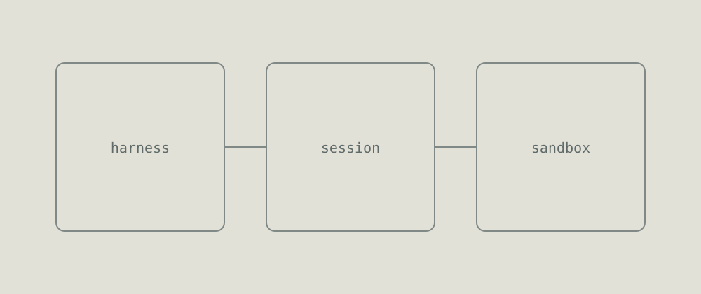

<!-- _class: cover -->

# Subako テーマ見本

Marp で運営スライドを素早く作るためのテーマ

###### SAMPLE DECK · 2026-09-13 · Kikuvi Inc.

---

###### HOW TO USE

# 使い方

front matter に 3 行書けば始められます。

```yaml
---
marp: true
theme: subako
paginate: true
---
```

あとは普通の Markdown で書けます。**無指定のスライドが既定レイアウト**で、
`###### アイブロウ` → `# 見出し` → 直後の段落がリード文、という順に組まれます。

---

###### TYPOGRAPHY

# 見出しとリード

`#` の直後の段落は自動的にリード文（20px・muted）になります。それ以降は本文です。

## 本文中の小見出し（h2）

段落の本文はこの大きさです。`code` はインラインで置けます。**強調**は太らせずに色を濃くするだけで、
段落の中で部分的に太字にしないのが Subako のルールです。

### さらに下の見出し（h3）

ここから下はサンセリフになります。

---

###### LISTS

# 箇条書き

- 投影を前提に 22px。運営スライドは箇条書きが主役になりがちなので少し大きめ
- マーカーの色は `--line-strong`
- 入れ子にすると一段小さくなります
  - 二階層目は 18px
  - 情報量が増えても潰れない
- `<!-- _class: compact -->` を付けると 18px まで落ちます

1. 番号付きも同じ
2. 受付 → 開会 → 開発 → 発表

---

<!-- _class: section -->

###### PART 1

# ダークの扉

章の切り替えに使います。六角形が右下に入ります。

---

<!-- _class: cards -->

###### COMPONENTS

# カード

- **harness** エージェントを動かす器。モデルとツールの間を取り持つ
- **session** 会話と作業の状態を保持する単位
- **sandbox** コードを実際に走らせる隔離環境

---

<!-- _class: cards -->

###### AUTO COLUMNS

# 列数は枚数から決まります

- **2 枚** なら 2 列
- **3 枚** なら 3 列
- **4 枚** なら 4 列。文字はこの大きさのまま
- **5 枚** になると文字が一段落ちて収まります

---

<!-- _class: cards dark -->

###### DARK CARDS

# カードはダークにもできます

- **`_class: cards dark`** クラスは空白区切りで併用できます
- **地が ink になる** カードは `#1F2B28`、罫は `#35423F`
- **グレインも切り替わる** 明部は乗算、暗部はスクリーン

---

# 表

運営スライドで一番使うのはたぶんこれです。

| 時刻 | 内容 | 場所 |
|---|---|---|
| 10:00 | 受付・チェックイン | 1F ロビー |
| 10:30 | 開会・ルール説明 | ホール |
| 11:00 | 開発開始 | 各チーム席 |
| 17:00 | 提出締切 | — |
| 17:30 | 発表・審査 | ホール |

> 引用は注記として使えます。罫が左に付いて paper 地になります。

---

<!-- _class: code-text -->

###### SDK

# コードとポイント

`_class: code-text` でコード左・箇条書き右の 2 段組になります。

```js
import { createSession } from "@subako/sdk";

const session = await createSession({
  skills: ["search", "code"],
  sandbox: "node20",
});

await session.run("競合を3社調べて表にして");
```

- サーバー 1 コール、クライアント 1 コンポーネント
- 秘密は vault に置いたまま、SDK には出てこない
- サンドボックスの寿命はセッションに紐づく

---

<!-- _class: statement -->

# Build agents. Not infrastructure.

英語の見出しは Playfair Display、日本語の見出しはヒラギノ明朝に自動で分かれます。同じ 1 行の中に混ざっていても構いません。

---

<!-- _class: statement dark -->

# エージェントを、もっと近くに。

`_class: statement dark` でダーク版になります。

---

<!-- _class: compact -->

###### TIMETABLE

# 項目が多いとき

`_class: compact` で箇条書きと表が一段小さくなります。運営スライドのタイムテーブルはこれで入ります。

| 時刻 | 内容 | 担当 |
|---|---|---|
| 09:30 | 会場オープン | 運営 |
| 10:00 | 受付・チェックイン | 運営 |
| 10:30 | 開会・ルール説明 | 柏 |
| 11:00 | チームビルディング | 全員 |
| 12:00 | 開発開始 | 各チーム |
| 15:00 | 中間共有（任意） | 各チーム |
| 17:00 | 提出締切 | 各チーム |
| 17:30 | 発表（5 分 x チーム数） | 各チーム |
| 18:30 | 審査・表彰 | 審査員 |
| 19:00 | 懇親会 | 全員 |

---

<!-- _class: media -->

###### DIAGRAM

# 画像



---

<!-- _class: plain center -->

# `_class: plain`

著作権表記とページ番号を消します。`center` と併用すると上下中央に寄ります。

---

<!-- _class: thanks -->

# ありがとうございました

hackathon@kikuvi.example / #subako-hackathon
